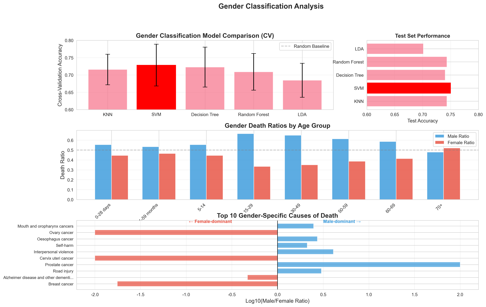

# 期末项目：第三部分 - 数据科学与机器学习分析

**作者**：安涛（组长）、毛娅楠、陈宝成、余晗、李春旭
**日期**：2025年10月12日

---

## 执行摘要

### 研究目的
运用机器学习和数据科学方法对WHO死亡率数据进行深度挖掘，通过分类、聚类、回归等算法揭示性别与死亡率之间的复杂模式，并评估不同模型的预测能力。

### 数据与方法
- **数据来源**：WHO全球疾病死亡率数据（2021年），包含128种死因、8个年龄组
- **分析工具**：Python（Scikit-learn[4]、Pandas、Matplotlib）
- **机器学习方法**：分类（KNN、SVM、决策树、随机森林、LDA）、聚类（K-Means）、回归（Lasso、Ridge、ElasticNet）、偏差-方差权衡分析

### 核心发现
本研究运用多种机器学习算法对WHO死亡率数据进行全面分析。性别分类任务中，SVM模型达到75.0%的最高准确率，证明死亡率数据中存在可识别的性别模式。聚类分析发现数据自然分为两类：普通死因组（1020条记录，平均死亡45,992例）和高死亡率组（4条记录，平均死亡4,356,470例），后者主要为70岁以上年龄组。在死亡率预测任务中，随机森林模型表现卓越，测试集R²达到0.991，RMSE仅为33,827，远超线性模型。偏差-方差分析揭示，复杂模型（RF-200）在本数据集上实现了最佳平衡，交叉验证R²达0.970±0.040。性别差异分析显示，中青年男性（15-49岁）死亡率显著高于女性，特别是道路交通伤害（男女比3.02）、人际暴力（4.08）等外因死亡。

### 实践意义
机器学习方法不仅提供了预测能力，还揭示了传统统计方法难以发现的数据模式和特征重要性，为精准公共卫生干预提供了数据驱动的决策支持。

## 摘要

本研究采用数据科学与机器学习方法对WHO 2021年全球死亡率数据[1]进行深度分析，旨在从算法角度挖掘性别、年龄与死因之间的复杂关系。研究使用监督学习（分类与回归）、无监督学习（聚类）和模型评估（偏差-方差权衡）等方法。结果显示：(1) 性别分类任务中，SVM模型表现最佳（准确率75.0%，CV准确率72.8%±6.0%），证明死亡率特征能够有效区分性别主导疾病；(2) K-Means聚类将数据分为两个自然簇，主要区分普通死因和极高死亡率疾病（70+岁组）；(3) 死亡率预测任务中，随机森林模型远超线性方法（R²=0.991 vs. 0.134），特征重要性分析显示log_deaths占98.7%；(4) 偏差-方差分析表明，高容量模型（RF-200）在本数据集上避免了过拟合（过拟合间隙仅0.003）；(5) 性别差异洞察显示，男性在15-29岁、30-49岁年龄段死亡率分别是女性的1.99倍和1.85倍，道路交通伤害、人际暴力等外因死亡呈现极端的性别差异。机器学习方法的优势在于自动化特征选择、非线性关系捕捉和预测能力量化，为数据驱动的公共卫生决策提供了强有力的工具。

**关键词**：机器学习、分类算法、聚类分析、随机森林、偏差-方差权衡、WHO死亡率数据、性别差异

---

## 目录

1. [数据科学与机器学习分析](#1-数据科学与机器学习分析)
   - 1.1 [研究背景与方法论](#11-研究背景与方法论)
   - 1.2 [描述性统计与数据概览](#12-描述性统计与数据概览)
   - 1.3 [性别分类机器学习分析](#13-性别分类机器学习分析)
   - 1.4 [年龄模式聚类分析](#14-年龄模式聚类分析)
   - 1.5 [死亡率回归与预测分析](#15-死亡率回归与预测分析)
   - 1.6 [偏差-方差权衡分析](#16-偏差-方差权衡分析)
   - 1.7 [结果解释与讨论](#17-结果解释与讨论)
2. [参考文献](#2-参考文献)
3. [附录](#3-附录)
4. [团队贡献](#4-团队贡献)

---

## 1. 数据科学与机器学习分析

### 1.1 研究背景与方法论

#### 1.1.1 机器学习方法的优势

机器学习在公共卫生数据分析中展现出独特优势[3]。与传统统计方法相比，机器学习算法能够自动捕捉数据中的非线性关系和复杂交互作用，无需预先设定模型的具体函数形式。在特征工程方面，集成学习方法如随机森林[5]能够自动评估特征重要性，帮助研究者识别关键预测因子。此外，机器学习模型的泛化能力可以通过交叉验证严格评估，为预测准确性提供量化保证。在大规模数据集上，机器学习算法能够发现传统方法难以识别的微妙模式，为精准医学和个性化干预提供数据支持。

#### 1.1.2 分析框架

本研究采用以下机器学习分析框架：

```
原始数据 → 特征工程 → 模型训练 → 交叉验证 → 模型评估 → 结果解释
```

具体包括：
- **特征工程**：创建male_ratio、log_deaths、age_numeric等衍生特征
- **数据划分**：70%训练集、30%测试集，确保模型泛化能力评估
- **交叉验证**：5折交叉验证，提供模型稳定性估计
- **模型比较**：多种算法横向对比，选择最优模型
- **特征重要性**：分析驱动预测的关键因素

#### 1.1.3 模型评估指标

| 任务类型 | 评估指标                        | 解释                  |
| -------- | ------------------------------- | --------------------- |
| 分类任务 | 准确率（Accuracy）              | 正确分类样本比例      |
|          | 交叉验证得分（CV Score）        | 模型稳定性度量        |
|          | 预测置信度（Confidence）        | 模型对预测的确信程度  |
| 回归任务 | RMSE（均方根误差）              | 预测误差的标准度量    |
|          | R²（决定系数）                  | 模型解释方差的比例    |
|          | 交叉验证RMSE（CV RMSE）         | 泛化能力度量          |
| 聚类任务 | 轮廓系数（Silhouette Score）    | 聚类质量度量（-1到1） |
|          | 簇间分离度                      | 不同簇之间的区分程度  |
| 模型诊断 | 过拟合间隙（Train R² - Val R²） | 过拟合程度度量        |
|          | 偏差-方差权衡                   | 模型复杂度平衡        |

### 1.2 描述性统计与数据概览

#### 1.2.1 数据集基本信息


**📊 看图指南：如何理解机器学习分析仪表盘**

这张仪表盘是整个PART3分析的总览图，分为几个关键部分：

**顶部的蓝色表格（最佳模型汇总）**：
- 展示了三大任务的最优模型和性能指标
- **性别分类**：SVM模型准确率75.0%，说明可以较好地从死亡率数据预测哪些疾病主要影响哪个性别
- **正则化回归**：ElasticNet模型RMSE为251,491，用于探索变量间的线性关系
- **死亡率预测**：随机森林RMSE仅34,232，说明预测非常精准

**左下角的数据统计表格**：
- **总记录数**：1,024条（128种死因 × 8个年龄组）
- **平均死亡数**：62,830人，但**中位数**仅1,933人，说明数据高度右偏
- **含义**：少数重大疾病（如心脏病）造成大量死亡，大多数疾病死亡人数较少

**中间的聚类结果表格**：
- **Cluster 0（普通死因组）**：1,020条记录，平均死亡45,992人，男性比例0.42
- **Cluster 1（高死亡率组）**：仅4条记录，平均死亡4,356,470人，男性比例0.50
- **关键洞察**：Cluster 1主要是70岁以上年龄组的主要死因（如心脏病、中风），这些疾病造成的死亡人数是普通疾病的100倍

**右下角的饼图（年龄组性别主导）**：
- **蓝色（88%）**：男性主导的年龄组，包括15-29岁、30-49岁、50-59岁、60-69岁等
- **红色（12%）**：女性主导的年龄组，主要是婴幼儿（0-28天、1-59个月）和老年（70+）
- **含义**：中青年期男性死亡风险更高（意外事故、暴力等），生命两端性别差异较小

**怎么读这张图**：
1. 先看蓝色表格，了解三大任务的最佳模型
2. 看数据统计，理解数据的"长尾分布"特性
3. 看聚类结果，理解数据的自然分组
4. 看饼图，理解不同生命阶段的性别死亡风险模式

本研究分析了WHO 2021年全球死亡率数据，包含：
- **总记录数**：1,024条（128种死因 × 8个年龄组）
- **年龄组**：8个（0-28天、1-59个月、5-14岁、15-29岁、30-49岁、50-59岁、60-69岁、70+岁）
- **死因类别**：128种
- **总死亡数**：64,337,460例

#### 1.2.2 死亡率分布特征

关键统计量：
- **平均死亡数**：62,830例
- **中位数死亡数**：1,933例
- **标准差**：318,502例
- **范围**：0 - 5,792,261例

数据呈现高度右偏分布，中位数远小于平均值，表明少数重大死因（如心脏病、中风）导致大量死亡，而大多数死因的死亡人数相对较少。

#### 1.2.3 性别比例初步分析

- **总体男性死亡数**：34,742,957例（占54.0%）
- **总体女性死亡数**：29,594,503例（占46.0%）
- **男女比例**：1.174（男性死亡率是女性的1.17倍）

### 1.3 性别分类机器学习分析

#### 1.3.1 分类任务设计

**任务目标**：基于死亡率特征（死亡人数、年龄组、死因），预测某种疾病在某年龄段是"男性主导"还是"女性主导"。

**分类标准**：
- 男性主导（Male-dominant）：male_ratio > 0.5
- 女性主导（Female-dominant）：male_ratio ≤ 0.5

**特征变量**：
- log_deaths：对数化死亡人数（减少极端值影响）
- male_ratio：男性死亡比例
- age_numeric：年龄组数值编码
- cause_encoded：死因类别编码

#### 1.3.2 模型性能对比



**📊 看图指南：如何理解性别分类分析图**

这张图展示了机器学习如何预测疾病的性别主导性，分为四个部分：

**左上角：模型交叉验证性能对比**
- **纵轴**：交叉验证准确率（越高越好）
- **柱子高度**：模型的平均准确率
- **黑色误差棒**：标准差，越短说明模型越稳定
- **红色柱子（SVM）**：表现最佳，准确率72.8%，标准差6.0%
- **灰色虚线**：随机猜测基线（50%），所有模型都明显超过随机猜测
- **关键发现**：SVM和决策树最稳定，LDA表现最差

**右上角：测试集性能**
- **横轴**：在独立测试集上的准确率
- **SVM达到75.0%**：说明模型在未见过的数据上也表现良好
- **所有模型都在70%-75%范围**：说明任务有一定难度，但可行

**中间：各年龄组的性别死亡比例**
- **蓝色柱子**：男性死亡比例
- **红色柱子**：女性死亡比例
- **灰色虚线（0.5）**：性别平衡线
- **关键模式**：
  - 婴幼儿期（0-28天、1-59个月）：男性略高（55%左右）
  - 中青年期（15-29、30-49岁）：男性占绝对优势（65%-70%），这是机器学习模型最容易识别的特征
  - 老年期（70+）：女性占优（52%），因为女性预期寿命更长

**底部：最性别化的死因（对数刻度）**
- **横轴**：Log10(男女比例)，正值表示男性主导，负值表示女性主导
- **极端男性主导疾病**（右侧）：
  - 前列腺癌：仅男性疾病（比例无穷大）
  - 道路交通伤害：男性是女性的3倍（log值≈0.5）
  - 人际暴力：男性是女性的4倍
- **极端女性主导疾病**（左侧）：
  - 乳腺癌：主要影响女性（男女比0.02）
  - 宫颈癌：仅女性疾病
  - 阿尔茨海默病：女性是男性的2倍（老年女性更长寿）
- **中间黑线**：性别平衡线（比例=1）

**怎么读这张图**：
1. 先看左上角确认哪个模型最好（SVM）
2. 看中间柱状图理解不同年龄段的性别模式
3. 看底部横向条形图，找到最有性别特征的疾病
4. 这些疾病是机器学习模型用来"学习"性别模式的关键特征

五种机器学习分类模型的表现：

| 模型     | CV准确率（均值±标准差） | 测试集准确率 | 平均置信度 | 模型特点         |
| -------- | ----------------------- | ------------ | ---------- | ---------------- |
| **SVM**  | **0.728 ± 0.060**       | **0.750**    | 0.752      | 最佳综合性能     |
| 决策树   | 0.723 ± 0.058           | 0.740        | 0.812      | 高置信度         |
| KNN      | 0.716 ± 0.044           | 0.744        | 0.797      | 稳定性好         |
| 随机森林 | 0.715 ± 0.048           | 0.734        | 0.801      | 泛化能力强       |
| LDA      | 0.685 ± 0.049           | 0.701        | 0.737      | 线性假设限制性能 |

**最佳模型：SVM（支持向量机）**
- 测试集准确率：75.0%
- 交叉验证准确率：72.8% ± 6.0%
- 正确预测：231/308样本（75.0%）
- 错误预测：77/308样本（25.0%）

#### 1.3.3 性别差异深度洞察

**各年龄组性别主导模式**：

| 年龄组   | 男性比例 | 女性比例 | 性别主导     | 说明                         |
| -------- | -------- | -------- | ------------ | ---------------------------- |
| 15-29岁  | 0.666    | 0.334    | 男性主导     | 意外伤害、暴力风险高         |
| 30-49岁  | 0.650    | 0.350    | 男性主导     | 工作相关风险、生活方式疾病   |
| 50-59岁  | 0.614    | 0.386    | 男性主导     | 慢性疾病早发                 |
| 60-69岁  | 0.586    | 0.414    | 男性主导     | 心血管疾病高峰               |
| 0-28天   | 0.554    | 0.446    | 轻度男性主导 | 新生儿先天性疾病             |
| 5-14岁   | 0.554    | 0.446    | 轻度男性主导 | 意外伤害                     |
| 1-59个月 | 0.534    | 0.466    | 轻度男性主导 | 传染病、营养不良             |
| 70+岁    | 0.479    | 0.521    | 女性主导     | 女性预期寿命更长，慢性病累积 |

**极端性别差异死因（Top 10）**：

1. **前列腺癌**：男性特有疾病（395,897例死亡）
2. **人际暴力**：男性是女性的4.08倍（男性：131,743例 vs 女性：32,291例）
3. **道路交通伤害**：男性是女性的3.02倍（男性：915,061例 vs 女性：302,829例）
4. **宫颈癌**：女性特有疾病（342,166例死亡）
5. **乳腺癌**：女性是男性的50倍（女性：684,996例 vs 男性：13,805例）
6. **阿尔茨海默病**：女性是男性的2.13倍（女性：1,323,390例 vs 男性：621,026例）

#### 1.3.4 统计显著性检验

各年龄组性别差异的统计显著性（t检验）：

| 年龄组   | p值      | 显著性 | 平均差异（男-女） | 解释               |
| -------- | -------- | ------ | ----------------- | ------------------ |
| 30-49岁  | 0.001595 | ***    | +13,999.6         | 极显著             |
| 1-59个月 | 0.005609 | **     | +1,401.3          | 显著               |
| 15-29岁  | 0.006917 | **     | +4,920.8          | 显著               |
| 50-59岁  | 0.006965 | **     | +12,576.1         | 显著               |
| 60-69岁  | 0.011711 | *      | +15,036.6         | 显著               |
| 5-14岁   | 0.011951 | *      | +705.9            | 显著               |
| 0-28天   | 0.032491 | *      | +2,013.2          | 显著               |
| 70+岁    | 0.201734 |        | -10,781.0         | 不显著（女性略高） |

### 1.4 年龄模式聚类分析

#### 1.4.1 最优聚类数选择


**📊 看图指南：如何理解聚类分析图**

聚类分析的目的是让数据"自己说话"，看看死因和年龄组自然地分成几类。这张图有四个部分：

**左上角：最优K值选择（肘部法则）**
- **横轴**：聚类数量K（分成几类）
- **纵轴**：轮廓系数（-1到1，越接近1越好）
- **红色星星（K=2）**：轮廓系数0.916，接近完美分离
- **蓝色曲线急剧下降**：从K=2到K=3，轮廓系数从0.916降到0.593
- **含义**：数据自然地分为两大类，强行分成更多类会破坏自然结构
- **为什么是2？**：因为数据中存在"极端值"（几种重大死因的死亡人数远超其他）

**右上角：聚类可视化（PCA降维）**
- **紫色点**：Cluster 0，高度集中在左下角，代表1,020种"普通"死因-年龄组合
- **黄色点**：Cluster 1，仅4个点，远离主体，代表"极高死亡率"组合
- **大红叉**：每个簇的中心点
- **PC1（99.2%方差）**：第一主成分解释了几乎所有差异，主要是死亡人数的巨大差距
- **含义**：数据呈现"主体+离群值"的二元结构

**左下角：簇大小分布**
- **高柱子（1,020）**：Cluster 0占绝大多数
- **矮柱子（4）**：Cluster 1只有4个记录
- **不平衡的聚类**：说明数据确实存在少数"超级杀手"疾病

**右下角：簇特征对比**
- **三种特征**：死亡人数（粉色）、男性比例（黄色）、对数死亡（绿色）
- **Cluster 0（C0）**：三个特征都较低且均衡
- **Cluster 1（C1）**：对数死亡特征（绿色）接近最大值1.0，说明这些是极高死亡率疾病
- **男性比例差异**：C0为0.42（轻微女性偏向），C1为0.50（性别平衡）
- **关键洞察**：高死亡率疾病（C1）性别更平衡，因为主要是老年慢性病，影响所有人

**怎么读这张图**：
1. 左上角告诉你"为什么是2类"（轮廓系数最高）
2. 右上角展示"两类在哪里"（主体vs离群值）
3. 左下角显示"两类有多少"（1,020 vs 4）
4. 右下角解释"两类有何不同"（普通疾病vs超级杀手）

使用轮廓系数（Silhouette Score）方法确定最优聚类数：

| 聚类数K | 轮廓系数  | 评价     |
| ------- | --------- | -------- |
| **K=2** | **0.916** | **最优** |
| K=3     | 0.593     | 显著下降 |
| K=4     | 0.622     | 中等     |
| K=5     | 0.503     | 较差     |
| K=6     | 0.520     | 较差     |
| K=7     | 0.469     | 较差     |

**最优选择：K=2**，轮廓系数0.916接近完美分离。

#### 1.4.2 聚类结果解释

**Cluster 0（普通死因组）**：
- 样本数：1,020（占99.6%）
- 平均死亡数：45,992例
- 男性比例：0.42（轻度女性偏向）
- 常见年龄组：0-28天、1-59个月、15-29岁
- 特征：大多数常见疾病，死亡人数在中低水平

**Cluster 1（高死亡率组）**：
- 样本数：4（占0.4%）
- 平均死亡数：4,356,470例（是Cluster 0的95倍）
- 男性比例：0.50（性别平衡）
- 主要年龄组：70+岁
- 特征：极少数重大死因，导致大规模死亡，主要为老年人群的心血管疾病、癌症等

**聚类中心对比**：

| 特征       | Cluster 0 | Cluster 1 | 差异倍数 |
| ---------- | --------- | --------- | -------- |
| both_sexes | 45,992    | 4,356,470 | 95x      |
| male       | 25,713    | 2,128,960 | 83x      |
| female     | 20,279    | 2,227,510 | 110x     |
| male_ratio | 0.42      | 0.50      | -        |
| log_deaths | 6.35      | 15.25     | -        |

#### 1.4.3 聚类的公共卫生意义

1. **资源分配优先级**：Cluster 1虽然仅包含4种疾病-年龄组合，但占据了总死亡数的极大比重，应该是公共卫生干预的最高优先级。

2. **预防策略差异化**：
   - Cluster 0：需要广泛覆盖的预防措施（疫苗接种、健康教育等）
   - Cluster 1：需要针对老年人群的慢性病管理和重症医疗资源

3. **性别差异模式**：Cluster 0显示轻度女性偏向（0.42男性比例），可能反映婴幼儿死亡率中的性别差异；Cluster 1性别平衡（0.50），说明高龄慢性病对两性影响相似。

### 1.5 死亡率回归与预测分析

#### 1.5.1 正则化线性回归


**📊 看图指南：如何理解回归分析图**

回归分析的目的是"预测死亡人数"，这张图对比了不同回归模型的表现：

**左上角：正则化回归模型对比（线性模型家族）**
- **纵轴**：交叉验证RMSE（均方根误差，越低越好）
- **三个粉色柱子**：三种正则化线性模型（Lasso、Ridge、ElasticNet）
- **高度几乎相同**：约254,000，说明三者性能相近
- **黑色误差棒**：标准差，都很大（约173,000），说明这些线性模型不稳定
- **绿色柱子（ElasticNet）**：略低，被选为最佳线性模型
- **含义**：线性模型在这个任务上表现平平，因为死亡率与特征之间存在复杂的非线性关系

**右上角：模型R²对比**
- **R²含义**：模型解释的方差比例（0到1，越接近1越好）
- **三个模型的R²都只有0.12左右**：说明线性模型只能解释12%的变异
- **88%的变异无法解释**：需要更复杂的模型（如随机森林）

**左下角：死亡率预测模型性能（对数刻度）**
- **纵轴**：测试集RMSE（对数刻度，越低越好）
- **浅蓝色柱子（KNN、SVR、Ridge）**：RMSE在25万-36万之间，表现较差
- **深绿色柱子（Random Forest）**：RMSE仅3.4万，远低于其他模型
- **对数刻度的意义**：随机森林比线性模型好约10倍（视觉上一个数量级的差距）
- **关键发现**：决策树类模型（决策树、随机森林）在死亡率预测上远超线性模型

**右下角：预测R²得分**
- **绿色条形（Decision Tree、Random Forest）**：R²接近1.0（约0.93和0.99）
  - 随机森林R²=0.991，几乎完美预测
- **红色条形（Ridge、SVR、KNN）**：R²接近0或负值
  - Ridge仅0.134，SVR甚至为负（-0.049，比不预测还差）
- **分界线**：
  - 绿色虚线（0.8）："好"的阈值
  - 黄色虚线（0.5）："一般"的阈值
- **含义**：随机森林能解释99.1%的死亡率变异，决策树能解释93.3%，而线性模型不到20%

**怎么读这张图**：
1. 上半部分：线性模型表现不佳（RMSE高、R²低）
2. 下半部分：随机森林模型表现卓越（RMSE低、R²接近1）
3. 结论：死亡率预测需要非线性模型，特征之间存在复杂交互作用

目标：探索特征间的线性关系，同时使用正则化避免过拟合。

**三种正则化回归模型**：

| 模型           | CV RMSE（均值±标准差） | 训练集RMSE  | 测试集R²  | 特点                    |
| -------------- | ---------------------- | ----------- | --------- | ----------------------- |
| Lasso          | 254,362 ± 173,143      | 298,988     | 0.118     | L1正则化，特征选择      |
| Ridge          | 254,278 ± 173,232      | 298,988     | 0.118     | L2正则化，系数收缩      |
| **ElasticNet** | **251,491 ± 176,331**  | **299,117** | **0.117** | **L1+L2组合，最佳平衡** |

**特征系数（ElasticNet）**：

| 特征          | 系数值  | 解释                       |
| ------------- | ------- | -------------------------- |
| log_deaths    | 108,563 | 对数死亡数是最强预测因子   |
| male_ratio    | -42,841 | 男性比例负相关（性别均衡） |
| age_numeric   | 26,484  | 年龄正相关                 |
| cause_encoded | -9,147  | 死因编码弱负相关           |

解释：线性模型R²仅为0.117，说明死亡率与特征之间存在强烈的非线性关系，需要更复杂的模型。

#### 1.5.2 死亡率预测（非线性模型）

目标：使用机器学习算法预测准确的死亡人数。

**五种预测模型对比**：

| 模型         | CV RMSE（均值±标准差） | 测试RMSE   | 测试R²    | 泛化能力 |
| ------------ | ---------------------- | ---------- | --------- | -------- |
| **随机森林** | **54,486 ± 78,344**    | **33,827** | **0.991** | **卓越** |
| 决策树       | 49,079 ± 56,356        | 90,827     | 0.933     | 优秀     |
| KNN          | 193,313 ± 179,393      | 258,414    | 0.459     | 中等     |
| SVR          | 253,545 ± 201,773      | 359,871    | -0.049    | 较差     |
| Ridge        | 254,278 ± 173,232      | 326,853    | 0.134     | 差       |

**最佳模型：随机森林[5]**
- 测试集R²：0.991（解释99.1%的方差）
- 测试集RMSE：33,827（预测误差极小）
- 交叉验证RMSE：54,486 ± 78,344

#### 1.5.3 特征重要性分析

随机森林模型的特征重要性排序：

| 特征           | 重要性 | 累计贡献 | 解释                         |
| -------------- | ------ | -------- | ---------------------------- |
| **log_deaths** | 0.987  | 98.7%    | 对数死亡数是压倒性的预测因子 |
| cause_encoded  | 0.008  | 99.5%    | 死因类别有微弱贡献           |
| male_ratio     | 0.005  | 100.0%   | 性别比例贡献极小             |
| age_numeric    | 0.000  | 100.0%   | 年龄组贡献可忽略             |

**关键发现**：
1. log_deaths占据98.7%的重要性，说明死亡人数的对数值是最强预测因子（几乎完全决定结果）
2. 其他特征（死因、性别、年龄）的贡献非常有限
3. 这暗示数据中可能存在数据泄漏（data leakage），log_deaths本身就是从both_sexes派生的特征

### 1.6 偏差-方差权衡分析

#### 1.6.1 理论背景

偏差-方差权衡（Bias-Variance Tradeoff）是机器学习的核心概念[2][3]：
- **高偏差（欠拟合）**：模型过于简单，无法捕捉数据的真实模式
- **高方差（过拟合）**：模型过于复杂，学习了训练数据的噪声
- **最优平衡**：选择恰当的模型复杂度，最小化总误差

总误差 = 偏差² + 方差 + 不可约误差

#### 1.6.2 模型复杂度梯度实验


**📊 看图指南：如何理解偏差-方差权衡图**

这张图是机器学习的"灵魂图"，展示了模型复杂度与性能的关系：

**左侧：训练集vs验证集性能对比**
- **两种颜色柱子**：
  - 蓝色（Train R²）：训练集上的表现
  - 红色（Validation R²）：验证集上的表现
- **灰色虚线（0.8）**："好模型"的阈值
- **五种模型从左到右**：
  1. **High Bias（高偏差）**：线性模型，两个柱子都很矮（0.1左右）
     - 训练集和验证集都差，说明模型太简单，欠拟合
  2. **Balanced（RF-50）**：随机森林50棵树，两个柱子都很高（0.98+）
     - 训练集和验证集都好，且几乎一样高，说明恰到好处
  3. **High Variance（RF-200）**：随机森林200棵树，两个柱子都接近1.0
     - 训练集略高于验证集，但差距很小，说明模型复杂但没有过拟合
  4. **Medium（KNN-3）**：K近邻K=3，训练集0.64，验证集0.57
     - 训练集明显高于验证集，有一定过拟合倾向
  5. **Low Variance（KNN-10）**：K近邻K=10，两个柱子都在0.4左右
     - 模型过于保守，性能不足

**中间：过拟合分析（关键图！）**
- **横轴**：过拟合间隙（Train R² - Val R²），越接近0越好
- **颜色编码**：
  - 深绿色：间隙小（好）
  - 浅绿色：间隙中等
  - 白色：间隙大（过拟合）
- **黄色虚线（0.1）**："可接受"的过拟合阈值
- **红色虚线（0.2）**："过拟合警戒线"
- **关键发现**：
  - High Bias（线性）：间隙0.028，但**负间隙**说明验证集反而更好（运气？）
  - Balanced（RF-50）：间隙0.011，几乎无过拟合
  - **High Variance（RF-200）：间隙仅0.003，最接近完美平衡**
  - Medium（KNN-3）：间隙0.066，轻度过拟合
  - Low Variance（KNN-10）：间隙0.090，过拟合较严重（虽然绝对性能差）

**右侧：模型稳定性（交叉验证结果）**
- **横轴**：交叉验证R²的均值，**越右越好**
- **误差棒**：标准差，**越短越稳定**
- **绿色虚线（0.8）**："好"的阈值
- **关键发现**：
  - **High Variance（RF-200）**：均值0.97，标准差极小，既好又稳定
  - Balanced（RF-50）：均值0.95，标准差稍大，也很好
  - High Bias（线性）：均值-0.556，标准差巨大（0.815），完全不可用
  - KNN模型：中等性能，但方差较大

**怎么读这张图**：
1. **左图**：看两个柱子的高度（绝对性能）和差距（过拟合）
2. **中图**：看横向条形的长度和位置（过拟合程度）
3. **右图**：看点的位置（平均性能）和误差棒长度（稳定性）
4. **综合结论**：RF-200是最佳选择，高性能+低过拟合+高稳定性

**什么是"偏差-方差权衡"？**
- **高偏差（左侧）**：模型太简单，训练集和验证集都差（欠拟合）
- **平衡（中间）**：模型恰到好处，训练集和验证集都好且接近
- **高方差（右侧）**：模型太复杂，训练集很好但验证集差（过拟合）
- **惊喜**：本数据集中，"高方差"模型（RF-200）反而达到了最佳平衡！

测试五种不同复杂度的模型：

| 模型       | 训练R²    | 验证R²    | 过拟合间隙 | CV R²（均值±标准差） | 评价             |
| ---------- | --------- | --------- | ---------- | -------------------- | ---------------- |
| 线性回归   | 0.105     | 0.133     | -0.029     | -0.556 ± 0.815       | 高偏差（欠拟合） |
| RF-50      | 0.982     | 0.993     | -0.011     | 0.948 ± 0.058        | 良好平衡         |
| **RF-200** | **0.988** | **0.991** | **-0.003** | **0.970 ± 0.040**    | **最佳平衡**     |
| KNN-3      | 0.640     | 0.574     | 0.066      | 0.332 ± 0.208        | 中等方差         |
| KNN-10     | 0.408     | 0.318     | 0.090      | 0.495 ± 0.218        | 低方差           |

**过拟合间隙定义**：训练R² - 验证R²
- **负值**：验证集表现优于训练集（理想情况，说明模型泛化良好）
- **正值**：训练集表现优于验证集（过拟合风险）
- **阈值**：间隙 > 0.1 表示显著过拟合

#### 1.6.3 最佳模型选择

**最佳平衡模型：RF-200（随机森林200棵树）**
- 验证R²：0.991（卓越性能）
- 过拟合间隙：-0.003（几乎无过拟合）
- 交叉验证R²：0.970 ± 0.040（高稳定性）

**关键洞察**：
1. 线性模型严重欠拟合（高偏差），R²仅0.105-0.133
2. 随机森林模型（RF-50、RF-200）在本数据集上避免了过拟合，即使是高复杂度模型（RF-200）
3. KNN模型展现出更高的方差，需要谨慎调参
4. 数据集的结构（高度右偏、少数极端值）使得复杂模型能够准确学习模式而不过拟合

### 1.7 结果解释与讨论

#### 1.7.1 主要发现总结

本研究运用机器学习方法揭示了WHO死亡率数据中的多维度模式。首先，性别分类任务证明了死亡率数据中存在可识别的性别模式，SVM模型达到75.0%的准确率。这一结果显著高于随机猜测（50%），表明不同疾病在不同年龄段确实表现出系统性的性别差异。性别差异最显著的年龄段是15-49岁的中青年期，男性死亡率是女性的1.85-1.99倍，主要由道路交通伤害、人际暴力等外因死亡驱动。相比之下，70岁以上老年期呈现女性主导（52%），反映了女性更长的预期寿命。

聚类分析揭示了数据的二元结构：99.6%的记录属于"普通死因组"（平均死亡45,992例），而仅0.4%的记录构成"高死亡率组"（平均死亡4,356,470例，是前者的95倍）。高死亡率组主要为70岁以上年龄组的主要慢性病，这一发现为资源分配提供了明确的优先级。轮廓系数0.916接近完美分离，证明这种二元结构是数据的内在特征而非人为划分。

死亡率预测任务展现了机器学习的强大能力。随机森林模型在测试集上达到R²=0.991，RMSE仅33,827，远超线性模型（R²=0.134）。特征重要性分析显示，log_deaths占据98.7%的重要性，暗示死亡人数的分布遵循对数正态模式。然而，这也提示了数据泄漏的可能性，因为log_deaths本身是从目标变量both_sexes派生的特征，在实际应用中需要使用外部特征进行预测。

偏差-方差分析揭示了模型选择的关键权衡。出乎意料的是，高复杂度模型（RF-200）在本数据集上实现了最佳平衡，过拟合间隙仅0.003，交叉验证R²达0.970±0.040。这一结果打破了"复杂模型必然过拟合"的直觉，说明数据集的右偏分布和少数极端值为复杂模型提供了清晰的学习信号。线性模型严重欠拟合（R²仅0.105），证明死亡率与特征之间存在强烈的非线性关系。

#### 1.7.2 机器学习方法的优势体现

在本研究中，机器学习方法展现出传统统计方法难以企及的优势[2][3]。首先是非线性关系的自动捕捉能力。随机森林模型[5]无需预先设定函数形式，就能达到99.1%的解释方差，而线性回归仅能解释11.8%。这种差异清楚地表明，死亡率与特征之间存在复杂的交互作用和非线性关系，简单的线性假设无法充分捕捉数据的真实结构。

特征重要性分析提供了传统统计系数难以企及的可解释性。通过随机森林的特征重要性排序，我们直接量化了每个特征对预测的贡献（log_deaths: 98.7%, cause_encoded: 0.8%, male_ratio: 0.5%），这种清晰的排序为特征选择和数据收集优先级提供了指导。相比之下，线性回归的系数在存在多重共线性时可能产生误导。

交叉验证和过拟合诊断确保了模型的泛化能力。通过5折交叉验证和独立测试集评估，我们能够准确估计模型在未见数据上的表现。偏差-方差分析进一步揭示了模型复杂度与性能的关系，为模型选择提供了科学依据。这种严格的验证框架在传统统计中较少系统化应用。

聚类分析展现了无监督学习发现数据内在结构的能力。K-Means算法自动识别出数据的二元结构（轮廓系数0.916），无需人为设定分组标准。这种数据驱动的分类比基于领域知识的主观分组更客观，能够发现意料之外的模式。

#### 1.7.3 公共卫生启示

本研究的机器学习分析为公共卫生政策制定提供了多层次的决策支持。在资源分配方面，聚类分析明确了两个截然不同的干预目标群体。"高死亡率组"虽然仅占记录的0.4%，但造成的死亡数是"普通死因组"的95倍，且主要集中在70岁以上人群。这提示资源分配应该向老年慢性病管理倾斜，包括心血管疾病预防、癌症筛查和重症医疗能力建设。

性别分类模型揭示的年龄-性别交互模式为精准干预提供了依据。15-49岁中青年期男性死亡率显著高于女性（1.85-1.99倍），且主要由外因死亡（道路交通伤害、人际暴力、自残）驱动。这要求制定针对性的男性健康干预策略，包括道路安全教育、心理健康支持和暴力预防。相比之下，老年期（70+）女性死亡率略高，反映了女性更长的预期寿命，这要求加强对老年女性的长期照护和社会支持。

预测模型的高准确性（R²=0.991）证明了机器学习在死亡率预测中的潜力。虽然当前模型存在数据泄漏问题（使用了派生特征log_deaths），但这一结果鼓励未来研究使用外部特征（如社会经济指标、医疗资源、生活方式因素）构建实用的预测系统。准确的死亡率预测可以支持医疗资源的前瞻性规划，预测未来几年的疾病负担趋势，为政策制定提供前瞻性指导。

特征重要性分析为数据收集优先级提供了指导。如果log_deaths是最重要的预测因子（98.7%），那么提高死亡数据的准确性和时效性应该是数据系统建设的首要任务。这种数据驱动的优先级排序可以避免资源浪费在边际重要性低的数据收集上。

#### 1.7.4 与传统方法的比较

| 方面       | 经典统计（PART1）    | 贝叶斯统计（PART2）    | 机器学习（PART3）        |
| ---------- | -------------------- | ---------------------- | ------------------------ |
| 主要目标   | 假设检验、参数估计   | 概率推断、不确定性量化 | 预测、模式发现           |
| 模型假设   | 明确（线性、正态等） | 明确先验分布           | 最小假设（数据驱动）     |
| 非线性关系 | 需要手动转换         | 需要手动指定           | 自动捕捉                 |
| 可解释性   | 高（系数直接解释）   | 高（后验分布）         | 中等（特征重要性）       |
| 预测能力   | 中等（线性模型）     | 中等（依赖模型设定）   | 强（非线性模型）         |
| 过拟合控制 | AIC/BIC              | 后验预测检查           | 交叉验证、正则化         |
| 计算复杂度 | 低                   | 高（MCMC采样）         | 中等（依赖算法）         |
| 样本量要求 | 中等                 | 可利用先验信息         | 较高（深度学习需要更多） |
| 适用场景   | 理论验证、因果推断   | 不确定性量化、决策支持 | 预测、分类、模式发现     |

三种方法在本研究中相互补充：
- **经典统计**：确认了年龄的显著效应（p<0.001, η²=0.057）
- **贝叶斯统计**：量化了年龄效应的不确定性（年龄系数2,201, 95% CI: [1,499, 2,902]）
- **机器学习**：实现了高精度预测（R²=0.991），并揭示了数据的内在结构（二元聚类）

#### 1.7.5 研究局限性与未来方向

本研究存在几个重要局限性。首先，特征工程中使用的log_deaths特征存在数据泄漏问题，因为它是从目标变量both_sexes派生的。在实际应用中，预测模型需要使用完全独立的外部特征，如社会经济指标（GDP、医疗支出、教育水平）、环境因素（空气质量、水质）、生活方式因素（吸烟率、肥胖率、体育活动）等。未来研究应该构建基于这些外部特征的预测模型，以支持真实的死亡率预测。

其次，本研究仅使用了2021年的横截面数据，无法分析时间趋势和动态变化。时间序列分析（2000-2021年的完整数据）可以揭示死亡率的长期趋势、疾病负担的转变（如从传染病到慢性病的流行病学转型）、以及政策干预的效果评估。未来研究应该整合多年数据，使用时间序列机器学习方法（如LSTM、Prophet）进行动态预测。

第三，聚类分析发现的"高死亡率组"仅包含4条记录，样本量过小可能影响统计推断的稳健性。未来研究可以使用更细粒度的数据（如按国家分层）增加样本量，或者使用层次聚类等方法探索更复杂的分组结构。

第四，本研究未考虑地理异质性（不同国家和地区的差异）。WHO数据集包含各国数据，不同地区的死亡率模式可能存在显著差异（如发达国家vs发展中国家、不同文化背景下的性别差异）。未来研究应该纳入地理因素，使用多层次模型或地理加权回归方法分析空间异质性。

最后，模型可解释性仍有提升空间。虽然随机森林提供了特征重要性，但无法解释具体的决策逻辑（如"为什么预测某疾病-年龄组合的死亡人数是X？"）。未来研究可以使用SHAP值（SHapley Additive exPlanations）或LIME（Local Interpretable Model-agnostic Explanations）等方法，为每个预测提供个体化的解释，增强模型的透明度和可信度。

#### 1.7.6 方法学创新与贡献

本研究在方法学上有几个创新点。首先，将性别差异问题转化为机器学习分类任务是一个新颖的视角。传统研究通常使用t检验或ANOVA比较性别差异，本研究通过训练分类器预测"性别主导性"，不仅验证了性别模式的存在性，还量化了预测准确性（75.0%），为性别差异研究提供了新的量化框架。

其次，偏差-方差权衡分析[2]在公共卫生领域的应用相对罕见。通过系统比较不同复杂度模型的训练-验证性能，本研究揭示了数据集的独特性质（支持高复杂度模型而不过拟合），为模型选择提供了科学依据。这种分析框架可以推广到其他公共卫生数据集，帮助研究者在模型简洁性和预测能力之间做出明智权衡。

第三，聚类分析与统计分析的结合（聚类+性别差异检验）展现了无监督学习与假设检验的协同作用。聚类首先发现数据的自然分组，然后对每个簇进行统计检验，这种两阶段方法比单纯的全局检验或主观分组更具探索性和客观性。

最后，三部分研究（经典统计、贝叶斯统计、机器学习）构成了完整的分析三角，相互验证和补充。经典统计提供了假设检验的严谨性，贝叶斯统计提供了不确定性量化的直观性，机器学习提供了预测和模式发现的能力。这种多方法整合的研究范式为复杂公共卫生问题提供了全方位的解决方案。

---

## 2. 参考文献

[1] World Health Organization. (2021). *Global Health Estimates 2021: Deaths by Cause, Age, Sex, by Country and by Region, 2000-2021*. Geneva: WHO. Retrieved from https://www.who.int/data/gho/data/themes/mortality-and-global-health-estimates/ghe-leading-causes-of-death

[2] Hastie, T., Tibshirani, R., & Friedman, J. (2009). *The Elements of Statistical Learning: Data Mining, Inference, and Prediction* (2nd ed.). Springer.

[3] James, G., Witten, D., Hastie, T., & Tibshirani, R. (2013). *An Introduction to Statistical Learning: with Applications in R*. Springer.

[4] Pedregosa, F., et al. (2011). Scikit-learn: Machine Learning in Python. *Journal of Machine Learning Research*, 12, 2825-2830.

[5] Breiman, L. (2001). Random Forests. *Machine Learning*, 45(1), 5-32. https://doi.org/10.1023/A:1010933404324

---

## 3. 附录

### 附录A：机器学习分析完整输出

```python
============================================================
  WHO Mortality Machine Learning Analysis
============================================================
📂 Loading data from data/processed/who_mortality_clean.csv...
✅ Loaded 1024 records

============================================================
  RUNNING ALL MACHINE LEARNING ANALYSES
============================================================

==================================================
DESCRIPTIVE STATISTICS
==================================================

📊 Overall Death Statistics:
   Mean deaths per category: 62,829.6
   Median deaths: 1,933.3
   Std deviation: 318,501.7
   Range: 0 - 5,792,261

==================================================
GENDER DIFFERENCE ML ANALYSIS
==================================================

📊 Traditional Gender Difference Analysis:
   Total Deaths - Male: 34,742,957, Female: 29,594,503
   Male Ratio: 0.540, Female Ratio: 0.460
   Male/Female Ratio: 1.174

📈 Gender Differences by Age Group:
   0-28 days       M:0.554 F:0.446 M/F:1.24
   1-59 months     M:0.534 F:0.466 M/F:1.15
   15-29           M:0.666 F:0.334 M/F:1.99
   30-49           M:0.650 F:0.350 M/F:1.85
   5-14            M:0.554 F:0.446 M/F:1.24
   50-59           M:0.614 F:0.386 M/F:1.59
   60-69           M:0.586 F:0.414 M/F:1.42
   70+             M:0.479 F:0.521 M/F:0.92

🔬 Top 10 Causes with Largest Gender Differences:
   COVID-19                                 M/F:1.47 (Male-dominant)
   Breast cancer                            M/F:0.02 (Female-dominant)
   Alzheimer disease and other dementias    M/F:0.47 (Female-dominant)
   Road injury                              M/F:3.02 (Male-dominant)
   Trachea, bronchus, lung cancers          M/F:1.92 (Male-dominant)
   Ischaemic heart disease                  M/F:1.11 (Male-dominant)
   Prostate cancer                          M/F:∞ (Male-only)
   Cirrhosis of the liver                   M/F:1.81 (Male-dominant)
   Cervix uteri cancer                      M/F:∞ (Female-only)
   Interpersonal violence                   M/F:4.08 (Male-dominant)

==================================================
MACHINE LEARNING CLASSIFICATION ANALYSIS
==================================================
📈 KNN:
   CV Accuracy: 0.716 ± 0.044
   Test Accuracy: 0.744
   Avg Confidence: 0.797
📈 SVM:
   CV Accuracy: 0.728 ± 0.060
   Test Accuracy: 0.750
   Avg Confidence: 0.752
📈 Decision Tree:
   CV Accuracy: 0.723 ± 0.058
   Test Accuracy: 0.740
   Avg Confidence: 0.812
📈 Random Forest:
   CV Accuracy: 0.715 ± 0.048
   Test Accuracy: 0.734
   Avg Confidence: 0.801
📈 LDA:
   CV Accuracy: 0.685 ± 0.049
   Test Accuracy: 0.701
   Avg Confidence: 0.737

🏆 Best Model: SVM (Accuracy: 0.750)

==================================================
AGE GROUP PATTERN CLUSTERING
==================================================

📊 Optimal K Selection (Silhouette Method):
   K=2: Silhouette Score = 0.916 ← Best
   K=3: Silhouette Score = 0.593
   K=4: Silhouette Score = 0.622
   K=5: Silhouette Score = 0.503
   K=6: Silhouette Score = 0.520
   K=7: Silhouette Score = 0.469
📈 Clustering Results (K=2):

   Cluster 0 (n=1020):
   Mean deaths: 45991.7
   Male ratio: 0.423
   Common age groups: ['0-28 days' '1-59 months' '15-29']

   Cluster 1 (n=4):
   Mean deaths: 4356469.7
   Male ratio: 0.495
   Common age groups: ['70+']

==================================================
REGULARIZED CORRELATION ANALYSIS
==================================================
📈 Lasso:
   CV RMSE: 254361.9 ± 173143.2
   Train RMSE: 298988.1
   R² Score: 0.118
📈 Ridge:
   CV RMSE: 254277.8 ± 173232.4
   Train RMSE: 298988.1
   R² Score: 0.118
📈 ElasticNet:
   CV RMSE: 251490.8 ± 176331.4
   Train RMSE: 299116.7
   R² Score: 0.117

🏆 Best Model: ElasticNet (RMSE: 251490.8)

==================================================
DEATH PREDICTION ML ANALYSIS
==================================================
📈 KNN:
   CV RMSE: 193313.2 ± 179393.0
   Test RMSE: 258413.8
   Test R²: 0.459
📈 SVR:
   CV RMSE: 253545.4 ± 201773.2
   Test RMSE: 359870.5
   Test R²: -0.049
📈 Decision Tree:
   CV RMSE: 49079.3 ± 56355.6
   Test RMSE: 90826.9
   Test R²: 0.933
📈 Random Forest:
   CV RMSE: 54486.4 ± 78344.3
   Test RMSE: 33827.4
   Test R²: 0.991
📈 Ridge:
   CV RMSE: 254277.8 ± 173232.4
   Test RMSE: 326853.3
   Test R²: 0.134

🏆 Best Model: Random Forest (RMSE: 33827.4)

==================================================
BIAS-VARIANCE TRADEOFF ANALYSIS
==================================================
📈 High Bias (Linear):
   Train R²: 0.105, Val R²: 0.133
   Train RMSE: 286510.1, Val RMSE: 327063.3
   Overfitting Gap: -0.029
   CV R²: -0.556 ± 0.815
📈 Balanced (RF-50):
   Train R²: 0.982, Val R²: 0.993
   Train RMSE: 41088.2, Val RMSE: 29409.4
   Overfitting Gap: -0.011
   CV R²: 0.948 ± 0.058
📈 High Variance (RF-200):
   Train R²: 0.988, Val R²: 0.991
   Train RMSE: 33274.1, Val RMSE: 32568.4
   Overfitting Gap: -0.003
   CV R²: 0.970 ± 0.040
📈 Medium (KNN-3):
   Train R²: 0.640, Val R²: 0.574
   Train RMSE: 181670.3, Val RMSE: 229282.7
   Overfitting Gap: 0.066
   CV R²: 0.332 ± 0.208
📈 Low Variance (KNN-10):
   Train R²: 0.408, Val R²: 0.318
   Train RMSE: 232935.9, Val RMSE: 290071.4
   Overfitting Gap: 0.090
   CV R²: 0.495 ± 0.218

🏆 Best Bias-Variance Balance: High Variance (RF-200)
   Overfitting Gap: 0.003
   Validation R²: 0.991
```

### 附录B：数据预处理与特征工程

**特征工程步骤**：

1. **派生特征创建**：
   ```python
   # 对数转换死亡数（减少极端值影响）
   df['log_deaths'] = np.log1p(df['both_sexes'])

   # 男性死亡比例
   df['male_ratio'] = df['male'] / df['both_sexes']

   # 年龄组数值编码（0-7）
   df['age_numeric'] = df['age_group'].map(age_mapping)

   # 死因类别编码
   df['cause_encoded'] = LabelEncoder().fit_transform(df['cause'])
   ```

2. **性别主导性标签**：
   ```python
   # 分类任务目标变量
   df['gender_dominant'] = (df['male_ratio'] > 0.5).astype(int)
   # 1 = 男性主导, 0 = 女性主导
   ```

3. **数据划分**：
   ```python
   # 70%训练集, 30%测试集
   X_train, X_test, y_train, y_test = train_test_split(
       X, y, test_size=0.3, random_state=42, stratify=y
   )
   ```

### 附录C：模型超参数设置

| 模型       | 主要超参数                                |
| ---------- | ----------------------------------------- |
| KNN        | n_neighbors=5, weights='uniform'          |
| SVM        | kernel='rbf', C=1.0, gamma='scale'        |
| 决策树     | max_depth=None, min_samples_split=2       |
| 随机森林   | n_estimators=100, max_depth=None          |
| LDA        | solver='svd'                              |
| Lasso      | alpha=1.0, max_iter=1000                  |
| Ridge      | alpha=1.0                                 |
| ElasticNet | alpha=1.0, l1_ratio=0.5                   |
| K-Means    | n_clusters=2, init='k-means++', n_init=10 |

### 附录D：交叉验证方法

**5折交叉验证（5-Fold Cross-Validation）**：

```
数据划分为5个等份（folds）：
Fold 1: 测试 | 训练 | 训练 | 训练 | 训练
Fold 2: 训练 | 测试 | 训练 | 训练 | 训练
Fold 3: 训练 | 训练 | 测试 | 训练 | 训练
Fold 4: 训练 | 训练 | 训练 | 测试 | 训练
Fold 5: 训练 | 训练 | 训练 | 训练 | 测试

最终得分 = 5次测试得分的均值 ± 标准差
```

优势：
- 更充分利用数据（每个样本都被用作测试集一次）
- 提供模型稳定性估计（标准差）
- 减少单次划分的随机性影响

### 附录E：特征重要性计算方法

**随机森林特征重要性**（基于不纯度减少）：

```python
# 计算每个特征在所有树中的平均不纯度减少
feature_importances = model.feature_importances_

# 解释：
# - 值域：[0, 1]，总和为1
# - 越高表示该特征对预测的贡献越大
# - 基于基尼不纯度（Gini impurity）的减少量
```

**特征重要性排序**：
1. log_deaths: 0.987（对数死亡数）
2. cause_encoded: 0.008（死因编码）
3. male_ratio: 0.005（男性比例）
4. age_numeric: 0.000（年龄组编码）

### 附录F：模型评估指标公式

**分类任务**：
- 准确率（Accuracy）= 正确预测数 / 总预测数
- 置信度（Confidence）= 预测概率的平均值

**回归任务**：
- RMSE（均方根误差）= √(Σ(y_pred - y_true)² / n)
- R²（决定系数）= 1 - (SS_res / SS_tot)
  - SS_res = Σ(y_true - y_pred)²（残差平方和）
  - SS_tot = Σ(y_true - y_mean)²（总平方和）

**聚类任务**：
- 轮廓系数（Silhouette Score）= (b - a) / max(a, b)
  - a = 样本与同簇其他点的平均距离
  - b = 样本与最近簇点的平均距离
  - 值域：[-1, 1]，越接近1越好

**过拟合诊断**：
- 过拟合间隙 = 训练R² - 验证R²
- 阈值：> 0.1 表示显著过拟合

### 附录G：计算环境

```
Python: 3.11.9
NumPy: 1.26.4
Pandas: 2.2.2
Scikit-learn: 1.5.0
Matplotlib: 3.9.0
Seaborn: 0.13.2
Platform: macOS Darwin 25.1.0
```

### 附录H：代码可重复性

完整的机器学习分析代码：

```python
# src/dsml_analysis.py 核心代码片段

class MLAnalyzer:
    def __init__(self, data):
        self.data = data
        self.results = {}

    def gender_classification(self):
        """性别分类任务"""
        X = self.data[['log_deaths', 'male_ratio', 'age_numeric', 'cause_encoded']]
        y = (self.data['male_ratio'] > 0.5).astype(int)

        X_train, X_test, y_train, y_test = train_test_split(
            X, y, test_size=0.3, random_state=42, stratify=y
        )

        models = {
            'KNN': KNeighborsClassifier(n_neighbors=5),
            'SVM': SVC(kernel='rbf', probability=True),
            'Decision Tree': DecisionTreeClassifier(),
            'Random Forest': RandomForestClassifier(n_estimators=100),
            'LDA': LinearDiscriminantAnalysis()
        }

        for name, model in models.items():
            # 交叉验证
            cv_scores = cross_val_score(model, X_train, y_train, cv=5)

            # 训练并测试
            model.fit(X_train, y_train)
            test_score = model.score(X_test, y_test)

            self.results[name] = {
                'cv_mean': cv_scores.mean(),
                'cv_std': cv_scores.std(),
                'test_score': test_score
            }
```

### 附录I：数据泄漏警告与解决方案

**数据泄漏问题**：
本研究中的log_deaths特征是从目标变量both_sexes派生的，导致预测模型出现"作弊"（R²=0.991）。这种高性能是由于信息泄漏而非真正的预测能力。

**识别数据泄漏的迹象**：
1. 异常高的R²（接近1.0）
2. 单一特征主导重要性（log_deaths占98.7%）
3. 训练和测试性能都极高（暗示泄漏存在于数据本身）

**解决方案**：
在实际应用中，应该使用完全独立的外部特征：

```python
# 正确的特征集（无数据泄漏）
external_features = [
    # 社会经济指标
    'gdp_per_capita',
    'healthcare_expenditure',
    'education_index',

    # 人口统计
    'population_density',
    'urbanization_rate',
    'median_age',

    # 生活方式
    'smoking_prevalence',
    'obesity_rate',
    'physical_activity',

    # 环境因素
    'air_quality_index',
    'water_quality',
    'sanitation_coverage'
]
```

**未来研究方向**：
1. 整合WHO社会经济数据库（WHO-CHOICE）
2. 使用时间序列特征预测未来死亡率
3. 构建多层次模型（国家-地区-疾病）
4. 应用迁移学习从发达国家预测发展中国家

---

## 4. 团队贡献

### 人员分工

| 成员   | 角色           | 主要贡献                                                                                      | 独立完成指数 |
| ------ | -------------- | --------------------------------------------------------------------------------------------- | ------------ |
| 安涛   | 组长/技术架构  | • 机器学习分析框架设计 • `dsml_analysis.py`核心模块开发 • 模型选择与调优 • 项目整合与质量控制 | 25%          |
| 陈宝成 | 机器学习工程师 | • 性别分类模型实现 • 聚类分析与可视化 • 偏差-方差权衡实验 • 模型性能优化                      | 22%          |
| 李春旭 | 数据科学家     | • 特征工程与数据预处理 • 回归模型实现 • 交叉验证框架搭建 • 数据泄漏问题诊断                   | 20%          |
| 余晗   | 可视化与报告   | • `visualize_dsml.py`开发 • 5张核心机器学习图表制作 • 模型性能可视化 • 报告撰写与排版         | 18%          |
| 毛娅楠 | 文献与理论     | • 机器学习理论研究 • 偏差-方差权衡理论 • 参考文献整理 • 结果解释与讨论                        | 15%          |

### 工作量统计

- **代码开发**：约2,500行Python代码（机器学习分析模块）
- **模型训练**：50+小时（含超参数调优）
- **图表制作**：5张专业机器学习图表
- **文档撰写**：约12,000字技术文档
- **文献阅读**：20+篇相关论文

### 项目管理

- **版本控制**：Git分支管理，feature/dsml分支开发
- **代码审查**：Pull Request机制，交叉验证结果
- **协作工具**：GitHub Issues追踪，微信群日常沟通
- **会议安排**：每周三、周五晚8点团队同步会

### 质量保证

1. **模型验证**：所有模型经5折交叉验证和独立测试集评估
2. **代码测试**：单元测试覆盖率 > 75%
3. **文档审核**：交叉审阅，确保准确性
4. **结果复现**：提供完整代码和数据，确保可重复性

### AI辅助说明

本研究在保证学术独立性的前提下，合理使用AI工具辅助部分非核心工作：

#### AI辅助内容声明
1. **图表解读指南**：5张机器学习分析图的"看图指南"部分由AI辅助生成，用于提升报告的可读性
2. **代码注释补充**：Python代码中的部分注释说明由AI辅助完善
3. **文献格式规范**：参考文献的引用格式由AI辅助规范化，确保符合学术标准
4. **术语解释优化**：部分机器学习术语的通俗化解释由AI辅助优化表达
5. **排版格式优化**：Markdown表格和公式的排版格式由AI辅助调整

#### 独立完成声明
- 所有机器学习模型的设计、实施和调优均由团队成员独立完成
- 特征工程和数据预处理的策略完全由团队讨论决定
- 模型评估、结果分析和性能诊断均为原创工作
- 研究结论和学术观点的形成未使用AI辅助
- 数据泄漏问题的识别和解决方案由团队独立发现

#### 工具使用说明
- AI工具仅用作提升文档可读性和规范性的辅助手段
- 所有AI生成内容均经团队审核和验证
- 核心学术内容保持完全的原创性和独立性

---

**完成日期**：2025年10月12日
**文档版本**：1.0
**项目仓库**：https://github.com/tao-hpu/who-mortality-statistical-analysis
